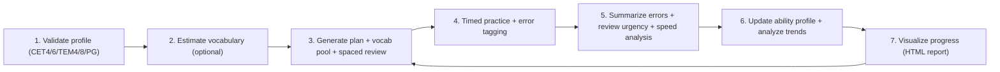

# Architecture

The repository is a local-first tutoring toolkit. Agents provide tutoring behavior through the Skill, while scripts provide deterministic state transitions.

## Learning Closed Loop

## Main Components

- `skills/examlex/SKILL.md`: portable Skill entry point.
- `skills/learning-planner/`, `skills/grammar-corrector/`, and the other shortcut directories: lightweight Agent Skill entry points for direct scenario calls.
- `skills/examlex/references/`: public-safe policy, workflow, data model, exam profiles, assistant roster, error taxonomy, Darwin rubric, multi-source distillation.
- `skills/examlex/assets/`: templates, JSON schemas (8 schemas total), vocabulary pools, test word lists, common error patterns, sample essays.
- `skills/examlex/assets/data/source-catalog.json`: merged CET/postgraduate media catalog with per-exam evidence labels, aliases, domains, and verified feed endpoints.
- `source-list` / `source-collect` / `source-fetch`: feed-first collection control plane. It indexes metadata by default and materializes one robots-allowed article or feed-enclosed media item only on explicit request.
- Platform-local `ExamLex/source-corpus/`: untracked manifest, per-item metadata, readable text, and selected media artifacts. It is learner/operator data and is never packaged.
- `skills/examlex/scripts/`: deterministic automation scripts — profile validation, vocabulary estimation, daily planning (with vocab pool + spaced repetition), practice recording (with timed mode), error summarization (with review urgency + speed analysis), ability update, trend analysis, writing versioning/scoring, strategy ingestion/validation, backup/restore (with incremental and verification), progress visualization.
- `skills/examlex/assets/data/vocabulary/`: a curated starter set of 649 unique built-in vocabulary entries across CET4/6/PG/TEM4/TEM8; legacy filenames remain available for compatibility.
- `skills/examlex/assets/data/common-errors/`: 22 common error patterns for Chinese learners across 5 modules.
- `skills/examlex/assets/data/sample-essays/`: model essays with rubric scores and structural annotations.
- `skills/examlex/scripts/`: portable script entry points.
- `examlex/scripts/`: importable script mirror validated by hash.
- `scripts/`: repository validator and platform installers.
- `integrations/`: platform-specific installation and usage notes.

## Data Flow

Durable learner state is JSON-compatible. YAML templates are authoring conveniences; script inputs and outputs should keep the same field names. Practice accuracy uses `total_items` and `correct_items` to avoid ambiguous calculations.

Prompt state is separate from learner state. Public files use placeholders and role descriptions. Full-local prompt assets, when used, stay outside the public Skill package.
