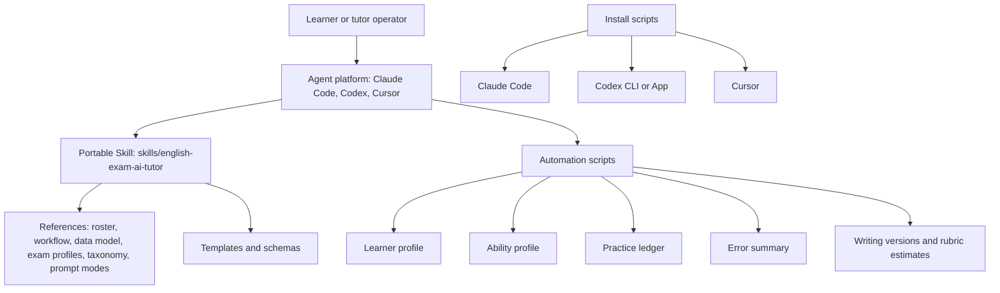
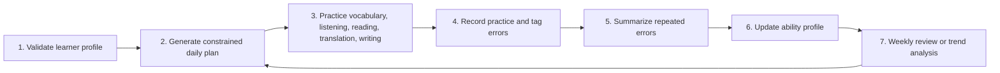

# Architecture

The repository is a local-first tutoring toolkit. Agents provide tutoring behavior through the Skill, while scripts provide deterministic state transitions.

## Learning Closed Loop

## Main Components

- `skills/english-exam-ai-tutor/SKILL.md`: portable Skill entry point.
- `skills/english-exam-ai-tutor/references/`: public-safe policy, workflow, data model, exam profiles, assistant roster, and error taxonomy.
- `skills/english-exam-ai-tutor/assets/`: templates and JSON schemas.
- `skills/english-exam-ai-tutor/scripts/`: portable script entry points.
- `skills/english_exam_ai_tutor/scripts/`: importable script mirror validated by hash.
- `scripts/`: repository validator and platform installers.
- `integrations/`: platform-specific installation and usage notes.

## Data Flow

Durable learner state is JSON-compatible. YAML templates are authoring conveniences; script inputs and outputs should keep the same field names. Practice accuracy uses `total_items` and `correct_items` to avoid ambiguous calculations.

Prompt state is separate from learner state. Public files use placeholders and role descriptions. Full-local prompt assets, when used, stay outside the public Skill package.
