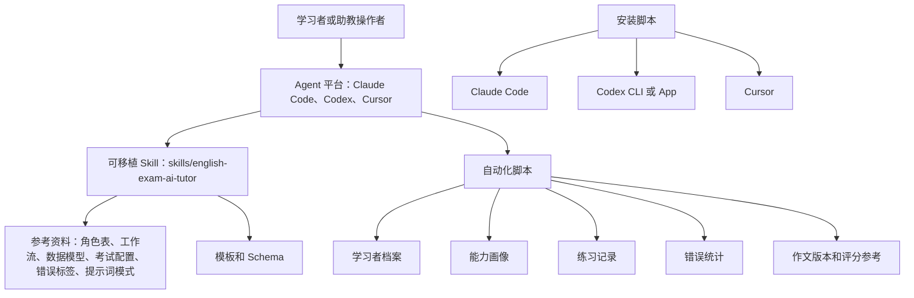
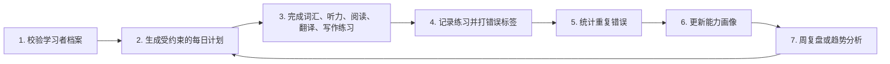

# 架构说明

本仓库是本地优先的英语考试助教工具包。Agent 通过 Skill 提供教学行为，脚本提供确定性的状态转换。

## 学习闭环

## 主要组件

- `skills/english-exam-ai-tutor/SKILL.md`：可移植 Skill 入口。
- `skills/english-exam-ai-tutor/references/`：公开安全策略、工作流、数据模型、考试配置、助教角色表和错误标签。
- `skills/english-exam-ai-tutor/assets/`：模板和 JSON Schema。
- `skills/english-exam-ai-tutor/scripts/`：可移植脚本入口。
- `skills/english_exam_ai_tutor/scripts/`：用于测试和命令行的可导入脚本镜像。
- `scripts/`：仓库校验器和平台安装器。
- `integrations/`：各平台的安装和使用说明。

## 数据流

持久化学习者状态使用 JSON 兼容数据。YAML 模板只是便于人工编辑，脚本输入输出仍应保持相同字段名。练习正确率使用 `total_items` 和 `correct_items`，避免 `total`、`correct` 这类含义不清的字段。

提示词状态和学习者状态分开管理。公开文件只使用占位符和角色描述。若使用 `full-local` 私有提示词资产，它们必须留在公开 Skill 包之外。
