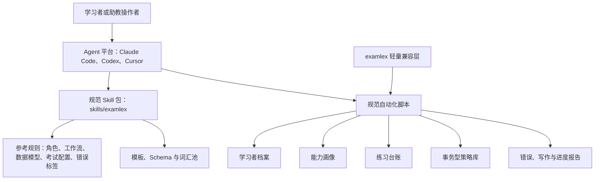

# 架构说明

ExamLex 是本地优先的英语考试助教工具包。Agent 通过 Skill 执行教学工作流，确定性脚本负责可审计的数据转换、校验与维护。

## 学习闭环

## 主要组件

- `skills/examlex/SKILL.md`：可移植 Skill 入口。
- `skills/examlex/references/`：公开安全策略、工作流、数据模型、考试配置、助教角色表、证据规则与错误标签。
- `skills/examlex/assets/`：模板、JSON Schema、题卷与答案册合同、词汇池、常见错误和范文索引。
- `skills/examlex/assets/data/source-catalog.json`：分考试保存证据等级、角色、域名与已核验订阅入口的题源目录。
- `skills/examlex/assets/data/vocabulary/`：四级 3,331 词、六级 3,650 词、考研英语 1,014 词的实际计数扩展池，以及专四、专八各 100 词的精选起步池。
- `source-list` / `source-collect` / `source-fetch`：RSS/Atom 优先的采集控制面；默认只建立元数据索引，显式选择后才获取一条允许访问的正文或订阅媒体附件。
- 系统本地 `ExamLex/source-corpus/`：未跟踪的清单、元数据、可读文本和已选媒体产物，不进入安装包。
- `skills/examlex/scripts/`：唯一规范实现，包括档案、计划、练习、词汇、写作、题卷答案册、策略库、容量监控、备份与报告工具。
- `examlex/`：历史导入路径和 CLI 的轻量兼容层，不复制脚本、参考文档或资源。
- `scripts/`：仓库校验器、安装器、容量计划任务安装器和 wheel 隔离冒烟测试。
- `integrations/`：各 Agent 平台的安装与使用说明。

## 数据与容量边界

学习者状态保持 JSON 兼容；策略库支持 JSON 交换格式和事务型 SQLite 主存储。重复策略只列为人工复核候选，任何策略与历史版本都不会自动删除。

可再生成的音频、字幕、全文和章节产物受时间与总容量硬上限约束；后台任务可以定期清理这些产物。策略库仅设置预警阈值，达到阈值时写入持久告警并列出可能重复版本。

公开提示词状态与学习者数据分离。仓库只保存占位符、角色边界和公开合同；私有提示词资产必须保留在公开 Skill 包之外。
